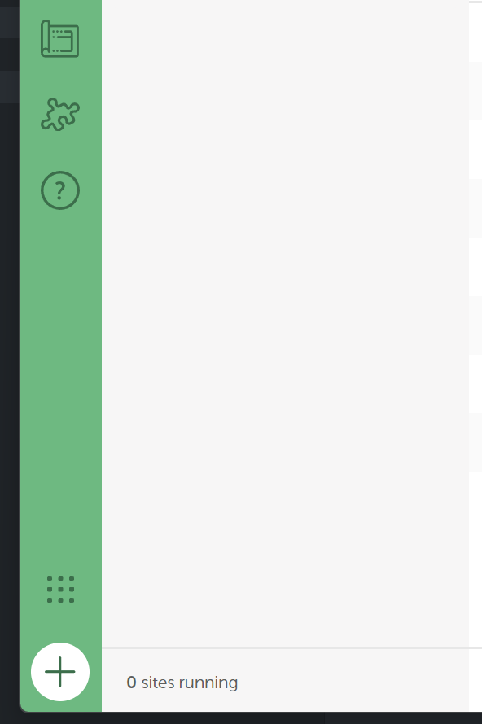
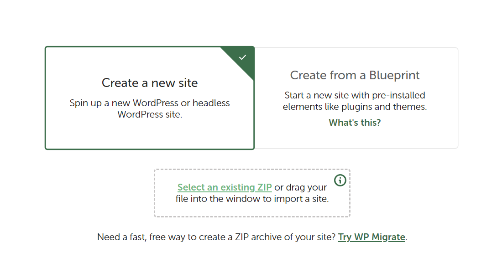
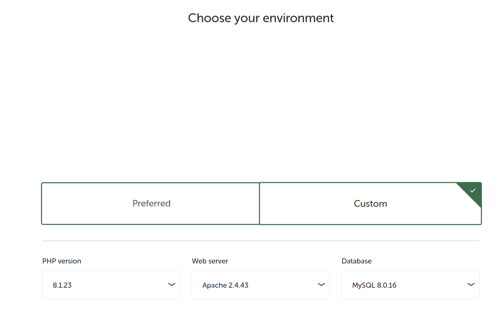
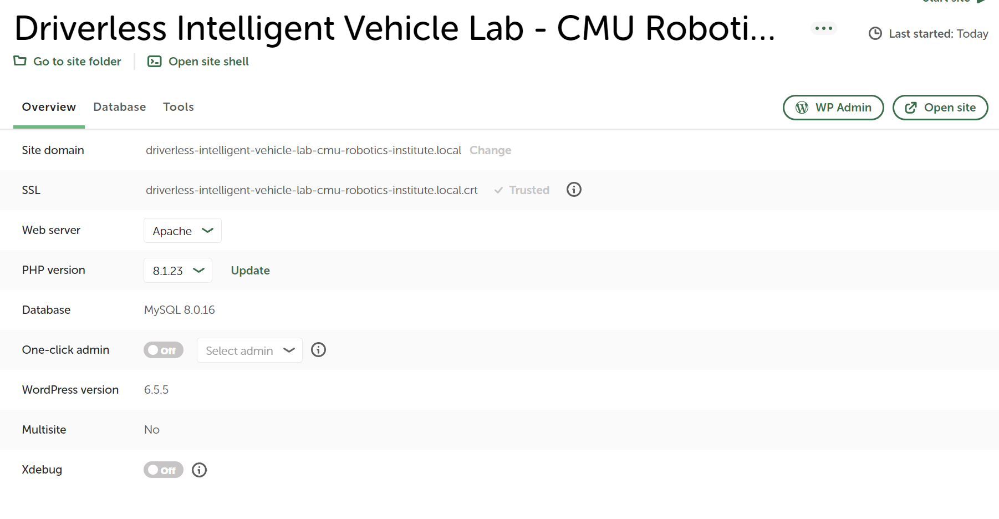
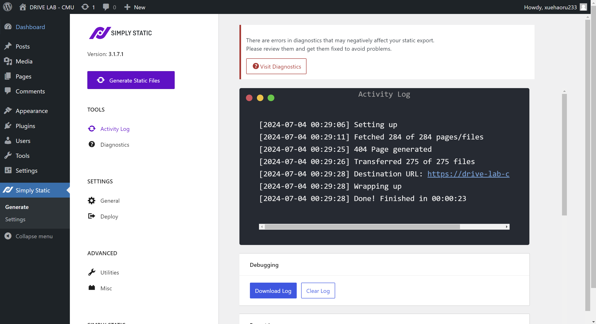
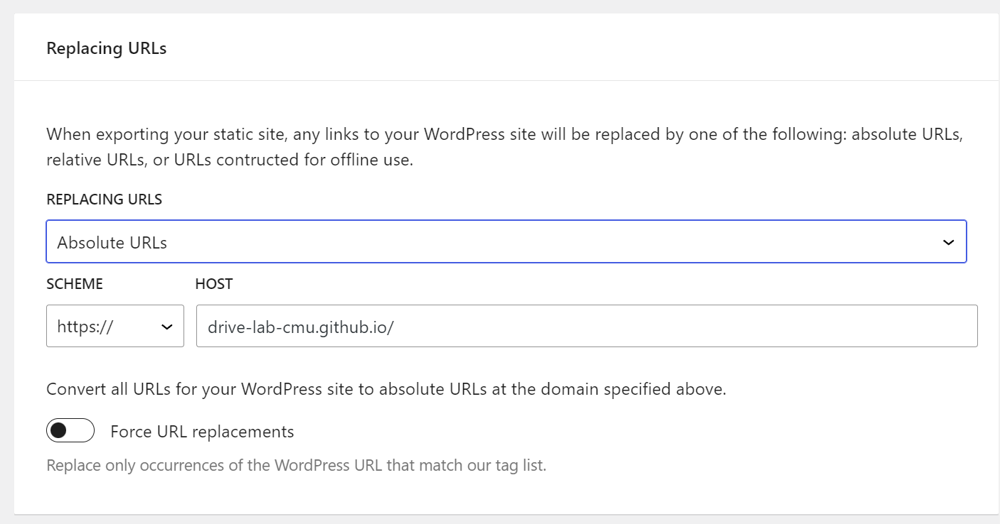
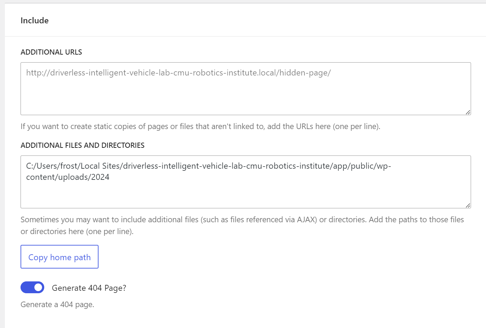
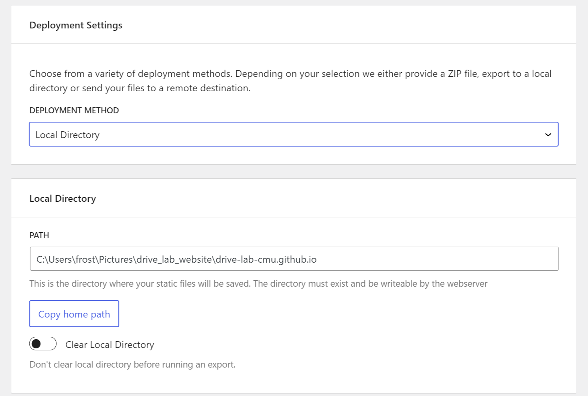
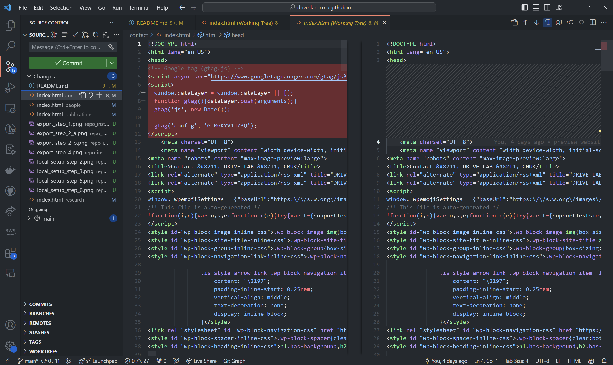

# DRIVE Lab Website

Follow the following instructions to maintain the website.

## Overview of the Workflow

We first edit the website hosted using [`Local`](https://localwp.com/) on your own computer. We then generate a static website into [this](https://github.com/DRIVE-LAB-CMU/drive-lab-cmu.github.io) repository, and then commit onto GitHub. We finally wait for the website generation to finish.

## Set Up Local WordPress Workspace

1. Download the exported website files from [Release](https://github.com/DRIVE-LAB-CMU/drive-lab-cmu.github.io/releases). (For now email Haoru Xue for the website files.)
2. Install [`Local`](https://localwp.com/). Click on the Add icon on the bottom left.

3. Click on "Select an exisiting ZIP", and choose the exported website files you downloaded.

4. In "Import site from archive", just click "Continue".
5. In "Choose your environment", choose Custom. Change Web server to Apache. Click "Import site".

6. Wait for the import to finish. Then click WP Admin. Ask Haoru Xue for account name and password.

7. You are now free to edit everything in WordPress!

## Prepare Static Site Export

1. After finishing editing the website, click on Simply Static in website admin page.

2. Click on "General" and confirm these export settings. Note that in "ADDITIONAL FILES AND DIRECTORIES", you must edit the path according to your own system (usually changing the user name is sufficient if your Local is installed in default location).

3. Clone [this](https://github.com/DRIVE-LAB-CMU/drive-lab-cmu.github.io) repository.
4. Continuing in the website admin page - Simple Static, click on "Deploy" and confirm these export settings. Once again you must change the path to match where you cloned the repository.

5. Click on "Diagnostics". everything except SSL should be okay.
6. Click on "Generate Static Files". Go to "Activity Log" and wait until the terminal outputs done.
7. Using VS Code, go to the repository folder. Carefully check for file updates.
8. **!!! Simply Static will try to remove the Google Tag from the pages. Undo that change for EVERY html file!!!** We use Google Tag to track site traffic, and removing them would make Google Analytics unable to track.

9. Commit and push the changes. But remember to carefully check that the Google Tags are not removed.

## Deploy the Site

Wait for GitHub Workflow to finish, and the website should be updated: <https://drive-lab-cmu.github.io/>.
